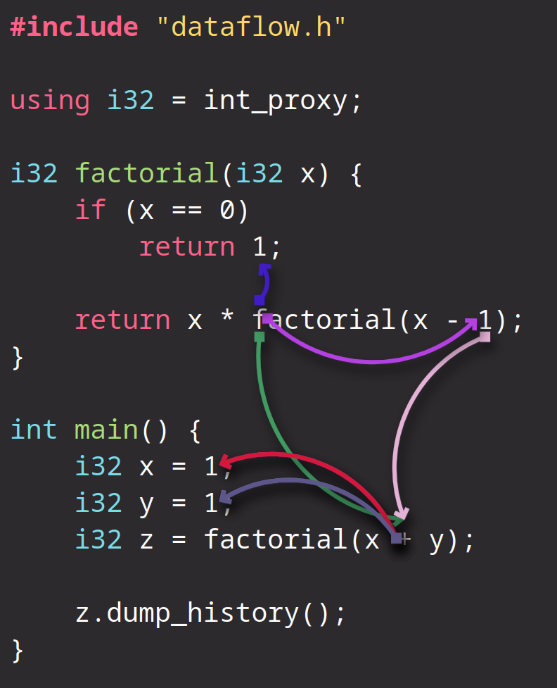

# WIP C++ dataflow visualization tool

This tool should produce a graph representing dataflow of a selected variable.

For example, for [such code](dataflow-track/src/main.cpp) it produces:


## Prerequisites

You need to have `Clang`, `Zapcc`, `CMake`, `Ninja`, `Emacs`, `Make` and `Coreutils`. Install all of them with your distribution's package manager.

## Building

Script [generate-graph](generate-graph) should take of it:
```sh
./generate-graph
```

This will generate single page website with desired graph produced from [such code](dataflow-track/src/main.cpp) in newly created `site` folder in project's root. You can open it with any browser:
```sh
firefox ./site/index.html
```
